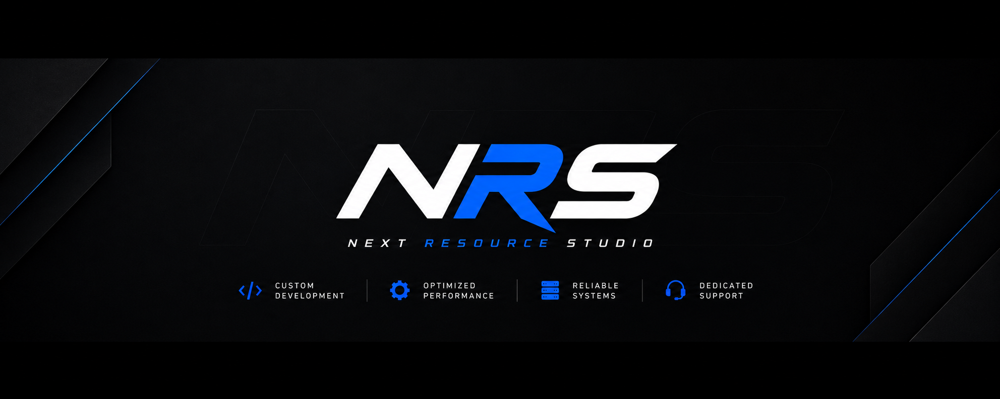

# Next Resource Studio

Documentation for all FiveM resources by Next Resource Studio.

[Browse Resources](resources/index.md){ .md-button .md-button--primary }
[Getting Started](getting-started.md){ .md-button }

---

## What's here

This site collects setup guides, config references, and troubleshooting for every resource we publish.

- :material-cube-outline: **[Ice_crafting](resources/ice_crafting/index.md)**

    Prop-based crafting stations for QBox and ESX Legacy, with a dark/minimal NUI.

- :material-walkie-talkie: **[Ice_radio](resources/ice_radio/index.md)**

    Handheld/mobile radio with trunked channels, encryption, and a dual voice backend.

- :material-book-open-page-variant: **[Getting Started](getting-started.md)**

    Dependencies, install steps, and conventions shared across all resources.

- :material-lifebuoy: **[Support](support.md)**

    Where to ask questions or report a bug.

